### David Jayakumar | G00419108 | Atlantic Technological University
[](https://github.com/DavidJ7705/AStar_algorithm)

---

## Introduction

A* is a heuristic-based pathfinding algorithm widely used in games, robotics, and navigation systems. It combines the completeness of **Dijkstra's algorithm** with the speed of **Greedy Best-First Search**. Dijkstra explores all possible directions from the starting node and always finds the shortest path, but can be slow on large graphs. Greedy Best-First is faster but sacrifices optimality — it might find *a* path but not the *best* one. A* strikes a balance by considering both the actual cost already travelled and an estimated cost to the goal, making it efficient while still guaranteeing an optimal path when an admissible heuristic is used.

The goal of this project was to implement A* in modern C++ using a grid-based environment with configurable obstacles, a start position, and a goal position. The project evolved iteratively across lab sessions — starting from a basic 2D vector grid and building up to a full multi-file pathfinding system with multiple heuristics, smart pointers, exception handling, and modular class design.

The core formula driving the algorithm:

```
f(n) = g(n) + h(n)
```

- `g(n)` = actual cost from the start node to node n
- `h(n)` = heuristic estimate from node n to the goal
- `f(n)` = total estimated cost — the value A* uses to prioritise which node to explore next

---

## Design & Implementation

### File Structure

The project is split across six files to keep responsibilities clearly separated:

| File | Purpose |
|------|---------|
| `types.h` | Shared types — `Point` struct and `HeuristicType` enum |
| `pathfinder.h / .cpp` | `PathFind` class — grid management and A* search |
| `heuristics.h / .cpp` | `Heuristics` class — distance calculations |
| `TestPathFind.h / .cpp` | All test cases |
| `main.cpp` | Entry point — wraps tests in try/catch |

This structure emerged from a deliberate decision to apply the **Single Responsibility Principle**: each file does one thing. `PathFind` handles pathfinding logic. `Heuristics` handles distance calculations. `types.h` owns the shared data types that both need. This separation is explained further in the Design Decisions section below.

### Grid Representation

The grid is a `std::vector<std::vector<int>>` where each cell holds one of three values:

- `0` = empty cell
- `1` = obstacle
- `2` = path (marked during reconstruction)

The `PathFind` class encapsulates the grid completely — all access goes through public methods (`setObstacle`, `setStart`, `setGoal`) that enforce bounds checking and throw on invalid input. Nothing outside the class writes directly to the grid internals.

### Point & Node Structs

A `Point` struct holds a grid coordinate (row and column). A `Node` wraps a `Point` with g, h, f costs and a parent pointer for path reconstruction:

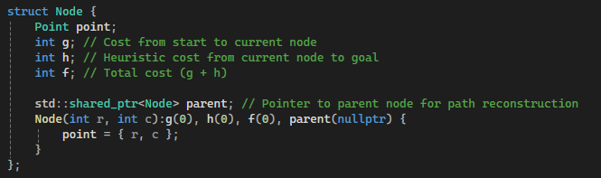


Separating `Point` from `Node` keeps the design clean — `Point` is a reusable coordinate type used independently across `PathFind`, `Heuristics`, and the operator overload, without dragging in pathfinding-specific fields.

### A* Search Algorithm

The algorithm maintains an open list (nodes to explore) and a closed list (visited nodes). At each step the node with the lowest f cost is selected, its neighbours are evaluated, and the process continues until the goal is reached or no path exists:

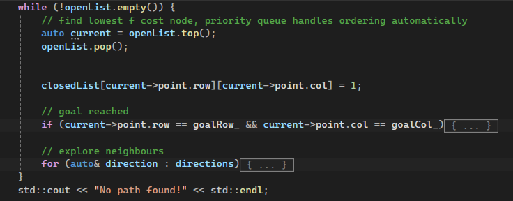

### Path Reconstruction

Once the goal is reached, parent pointers are followed back from goal to start. Each intermediate cell is marked as `2`, the path is reversed into start-to-goal order, and printed two ways — as a coordinate sequence and as a visual grid:

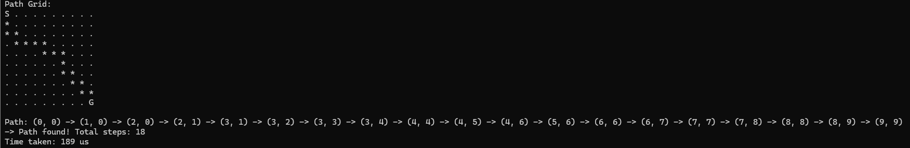


The coordinate output uses the `friend operator<<` on `Point`, which means each coordinate prints cleanly as `(row, col)` without repeating formatting code.

### Heuristics

Three distance functions are implemented in the dedicated `Heuristics` class:

#### **Manhattan Distance:**
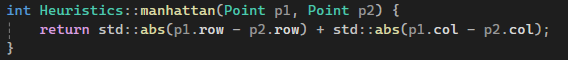

The most accurate for 4-directional grids. Never overestimates, satisfying **admissibility** — the property that guarantees A* finds the optimal path.

#### **Euclidean Distance:**
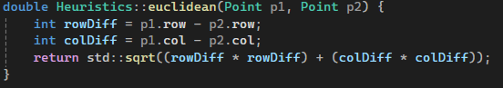

Straight-line distance. Slightly underestimates on 4-directional grids since diagonal movement is not available, but still admissible.

#### **Chebyshev Distance:**
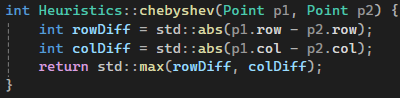

Designed for 8-directional movement including diagonals. Underestimates on this 4-directional grid, so it explores more nodes than necessary — but it is included for comparison and future extensibility to 8-directional movement.

---

## Design Decisions

These are the deliberate choices that shaped the architecture, and the reasoning behind each one.

### Why `types.h`?

When extracting the `Heuristics` class into its own files, a circular include problem immediately appeared: `heuristics.h` needed `Point` and `HeuristicType` from `pathfinder.h`, but `pathfinder.h` was also including `heuristics.h`. Neither file could include the other without causing a compile error.

The fix was to move the shared types (`Point` and `HeuristicType`) into a neutral header — `types.h` — that neither class owns. Both `pathfinder.h` and `heuristics.h` include `types.h` only, with no dependency on each other. This is a common real-world pattern: shared data types belong to a neutral header rather than to whichever class happened to define them first.

### Why a separate `Heuristics` class?

Originally all three distance functions were private methods on `PathFind`. That meant `PathFind` was doing two unrelated things: managing a grid and running pathfinding logic *and* calculating geometric distances. These are separate concerns.

Extracting `Heuristics` as its own class applies the **Single Responsibility Principle** — `PathFind` is responsible for pathfinding, `Heuristics` is responsible for distance calculation. This is also **composition over inheritance**: `PathFind` delegates to `Heuristics::calculate()` rather than inheriting distance logic or containing it internally.

```cpp
// PathFind::calculateHeuristic now just delegates
int PathFind::calculateHeuristic(Point p1, Point p2) {
    return Heuristics::calculate(heuristic_, p1, p2);
}
```


`PathFind` no longer knows *how* distances are calculated — only *that* they are. This means the heuristic logic could be extended or changed without touching the pathfinding code at all.

### Why are `Heuristics` methods `static`?

The `Heuristics` class holds no state — it is a collection of pure calculation functions that take two points and return a number. There is no reason to instantiate a `Heuristics` object. Making the methods `static` reflects this accurately: they belong to the class conceptually, but do not depend on any instance. Calling them as `Heuristics::calculate(...)` makes the intent explicit at the call site.

### Why throw `std::out_of_range` instead of printing errors?

The original implementation printed an error message and silently continued when an out-of-bounds position was passed to `setObstacle`, `setStart`, or `setGoal`. This meant invalid input could be ignored without the caller knowing. Throwing `std::out_of_range` instead means the error cannot be silently swallowed — it propagates up the call stack until it is caught, or terminates the program. The try/catch in `main.cpp` catches these at the top level and reports them cleanly:

```cpp
// main.cpp
try {
    RunTests(argc, argv);
}
catch (std::out_of_range& e) {
    std::cerr << e.what() << std::endl;
    return -1;
}
```

This is the pattern from the StackUnwinding lab — throw deep, catch high. The throw propagates through `TestNormalPath` → `RunTests` → `main`, demonstrating the full unwinding behaviour.

### Why route `generateRandom` through `setObstacle`?

The original `generateRandom` function wrote directly to `grid_` internals: `grid_[r][c] = 1`. This bypassed `setObstacle` entirely, which meant the bounds checking and exception throwing added to `setObstacle` were silently skipped for every randomly placed obstacle. The fix is a single change — call `setObstacle(r, c)` instead. Now all obstacle placement in the program goes through the same validated path regardless of how it was triggered. The design is consistent with itself.


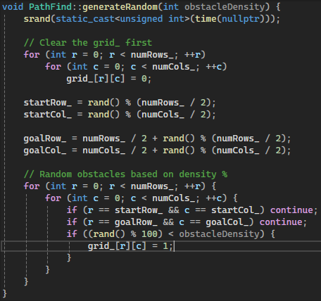


### Why `std::mt19937` over `rand()`?

The original random grid generation used `srand` and `rand()` — both C-style functions with known problems: `rand()` has poor statistical distribution on many platforms, and `srand(time(nullptr))` reseeds the same sequence if called within the same second. `std::mt19937` is a proper C++11 random number generator with a well-defined distribution, seeded from `std::random_device` which draws from the operating system's entropy source. This is a straightforward modern C++ replacement with no downsides.


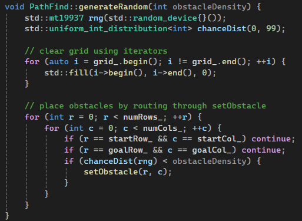


---

## Modern C++ Features

### Smart Pointers (`std::shared_ptr`)

During early development, nodes were stored by value in `std::vector<Node>`. Every `push_back` created a copy of the node, and parent pointers pointed to those copies — which could move in memory or be destroyed as the vector resized. This made path reconstruction completely unreliable.

The first fix was switching to raw pointers (`Node*`) to give nodes fixed heap addresses. The second upgrade was replacing raw pointers with `std::shared_ptr<Node>` — each node lives on the heap at a fixed address, with automatic memory cleanup. No manual `delete` is needed. This mirrors exactly what the CrowdStrike lab demonstrated: raw pointer misuse leads to crashes; smart pointers prevent them structurally.

```cpp
// Old — unreliable, manual memory
Node* startNode = new Node(startRow, startCol);

// New — fixed address, automatic cleanup
auto startNode = std::make_shared<Node>(startRow, startCol);
```

### `std::priority_queue`

The original open list used a `std::vector<Node>` with a manual for-loop to find the lowest f score on every iteration — O(n) per step. Replacing it with `std::priority_queue` and a `CompareNode` comparator struct means the lowest f node is always at the top, retrieved instantly with `top()`. The ordering is maintained automatically on every `push`.

```cpp
std::priority_queue<
    std::shared_ptr<Node>,
    std::vector<std::shared_ptr<Node>>,
    CompareNode
> openList;
```

### `enum class HeuristicType`

C++11 scoped enum for heuristic selection. Unlike plain `enum`, values are scoped to `HeuristicType::MANHATTAN` — they do not leak into the surrounding namespace and cannot be accidentally compared with unrelated integer values.

```cpp
// Old — values leak into global scope
enum Heuristic { MANHATTAN, EUCLIDEAN };

// Modern — scoped and type-safe
enum class HeuristicType { MANHATTAN, EUCLIDEAN, CHEBYSHEV };
```

### `friend operator<<` for `Point`

Rather than writing `"(" << p.row << ", " << p.col << ")"` every time a coordinate is printed, a `friend` function on `Point` handles this once:

```cpp
friend std::ostream& operator<<(std::ostream& os, const Point& p) {
    return os << "(" << p.row << ", " << p.col << ")";
}
```

This makes coordinate path printing a clean range-based for loop — the operator handles the formatting automatically.

### Range-Based For Loops

Neighbour exploration uses a `std::vector<std::pair<int,int>>` of direction offsets with a range-based for loop instead of index arrays:

```cpp
std::vector<std::pair<int, int>> directions = { {-1,0}, {1,0}, {0,-1}, {0,1} };

for (auto& direction : directions) {
    int newRow = current->point.row + direction.first;
    int newCol = current->point.col + direction.second;
}
```

### Lambdas

Used in `TestHeuristicComparison` to run the same grid configuration across all three heuristics without repeating the setup code:

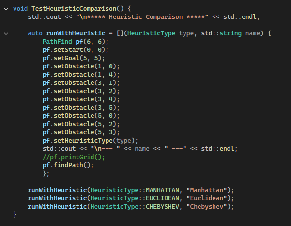


### Pre-increment (`++r` / `++c`)

All loop counters in the project use pre-increment (`++r`) rather than post-increment (`r++`). For primitive types like `int` this makes no performance difference, but for iterators and objects post-increment creates an unnecessary temporary copy of the previous value before incrementing. Using pre-increment consistently is the correct modern C++ habit — it communicates intent clearly (increment this, use the new value) and avoids the overhead when the type is not a primitive. Michelle's lab materials use `++i` style throughout, and applying it here keeps the codebase consistent with that convention.

// Old — post-increment, creates a temporary for non-primitives

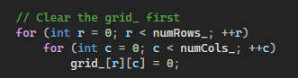


// New — pre-increment, no unnecessary temporary

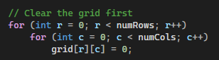

### `std::chrono` Timing

Each call to `findPath()` is timed using `std::chrono::steady_clock`, with the elapsed time printed in microseconds. On small grids the differences are subtle, but the `TestHeuristicComparison` output shows Chebyshev consistently running slightly faster than Manhattan and Euclidean — because `std::max` of two integers is cheaper than Manhattan's two `abs` calls or Euclidean's `sqrt`. On larger grids this difference compounds.

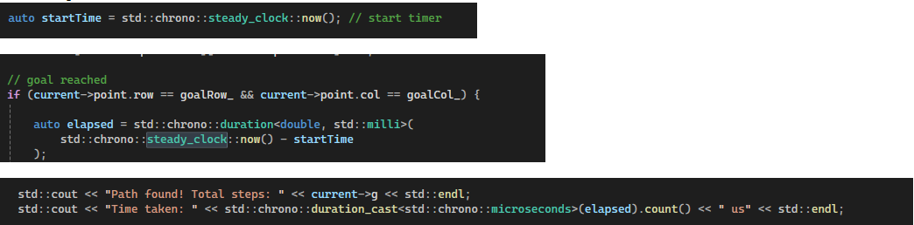


---

## Testing & Validation

Tests follow the same multi-file structure as the example project from the course. A `RunTests()` function in `TestPathFind.cpp` calls each individual test, keeping `main.cpp` clean and minimal.

### TestNormalPath
A 6x6 grid with a zigzag obstacle layout forcing a non-trivial path. Run with both Manhattan and Euclidean heuristics to compare route shapes. The two heuristics find paths of the same optimal length but navigate the obstacles differently.

### TestPathNoObstacles
A 10x10 open grid comparing all three heuristics. All three return 18 steps from `(0,0)` to `(9,9)` — because 4-directional movement requires exactly 9 row moves + 9 column moves = 18 minimum steps regardless of heuristic. The paths look visually different as each heuristic guides the search differently, but all find the same optimal cost.

### TestStartSameGoal
Start and goal at the same position `(2,2)`. The algorithm correctly identifies the goal immediately and returns 0 steps without entering the search loop.

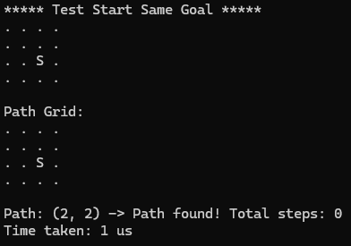


### TestNoPath
A 4x4 grid where the start is completely surrounded by obstacles with no route to the goal. Returns `"No path found!"` correctly.

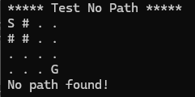


### TestRandomPath
A 10x10 grid with manually set start `(0,0)` and goal `(9,9)`, and obstacles placed randomly via `generateRandom`. Demonstrates that random obstacle generation respects the existing start and goal positions, routes through `setObstacle` for consistent bounds checking, and uses `std::mt19937` for proper randomness.

Sample output:


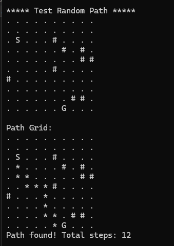


---

## Heuristic Comparison Output

### TestHeuristicComparison
Runs all three heuristics on identical obstacle layout using a lambda. Demonstrates that all three are admissible — they all find the optimal path cost — while producing different route shapes and measurably different runtimes.

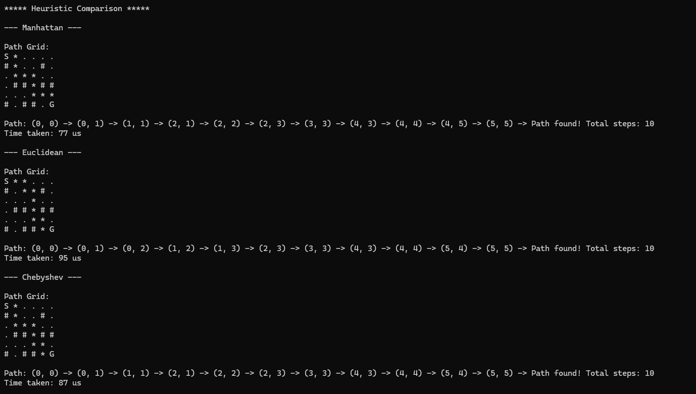


Three observations worth noting:

**All three find the optimal path** — 10 steps each. This confirms that all three heuristics are admissible for this grid: they never overestimate, so A* always finds the shortest path regardless of which one is selected.

**They take different routes** — Manhattan and Chebyshev navigate down the left side of the grid; Euclidean cuts across the top. Same cost, different paths. This happens because the heuristics prioritise differently when multiple routes look equally promising.

**Chebyshev is fastest** — because `std::max` of two integers is computationally cheaper than Manhattan's two `std::abs` calls or Euclidean's `std::sqrt`. On small grids the gap is small but consistent.

---

## Limitations

**4-directional movement only** — the implementation moves up, down, left, and right. Chebyshev distance is specifically designed for 8-directional grids with diagonal movement; extending to 8 directions would allow a genuine comparison showing Chebyshev outperforming Manhattan and Euclidean.

**No weighted cells** — all empty cells cost 1 to traverse. Introducing weighted cells (e.g. terrain cost 2, water cost 5) would demonstrate A*'s true strength: finding the optimal *cost* path rather than just the fewest steps.

**No re-pathfinding** — the grid is static. A dynamic version where obstacles can appear mid-search, requiring D* Lite or similar replanning, would be a natural extension.

**Small grid sizes** — heuristic timing differences are in the microsecond range on 6x6 and 10x10 grids. Larger grids (100x100+) would produce more meaningful performance comparisons between heuristics.

---

## Project Management

Development followed an iterative approach across weekly lab sessions, with each session building on the previous one. The table below maps each session to the work completed.

| Date | Session | Progress |
|------|---------|----------|
| 04/02 | Week 1 | Project setup, 2D vector grid with `printGrid`, range-based loop first use |
| 11/02 | Week 2 | Multi-file OOP structure, `setObstacle`, `setStart`, `setGoal`, S/G display |
| 18/02 | Week 3 | `Point` struct, Manhattan distance, `Node` struct, A* search loop initial implementation |
| 18/02 | Week 3 | Memory bug found: value-stored nodes caused unreliable parent pointers; fixed with raw pointers then upgraded to `std::shared_ptr` |
| 19/02 | Week 4 | Test structure setup, `std::priority_queue` replacing manual lowest-f loop, Euclidean distance, `enum class` heuristic selection |
| 19/02 | Week 4 | Chebyshev distance, lambda in `TestHeuristicComparison`, range-based for loop with direction vector |
| 12/03 | Week 5 | Identified bad C++ practices in `generateRandom` (C-style `rand`, `r++`, direct grid writes); planned fixes |
| 16/03 | Week 6 | Trailing underscores on private members, `std::out_of_range` throws replacing error prints, `Heuristics` class extraction, `types.h` circular include resolution, pre-increment throughout |
| 17/03 | Week 7 | `friend operator<<` on `Point`, coordinate path printing, `generateRandom` rewrite with `std::mt19937`, `std::chrono` timing |

Progress was tracked through OneNote lab logs documenting each decision, problem encountered, and resource referenced. GitHub was used for version control with commits at each significant milestone. Key design decisions were made incrementally — for example, the switch from raw pointers to smart pointers came directly from encountering a real memory bug during path reconstruction rather than being planned upfront.

---

## Reflection

### Biggest Problems Encountered

**Parent pointer tracking with value-based nodes**
The most significant technical challenge was path reconstruction. Initially nodes were stored by value in `std::vector<Node>`. Every `push_back` created a copy of the node, and parent pointers pointed to those copies — which could be moved or destroyed as the vector resized, making reconstruction completely unreliable. The fix was switching to `std::shared_ptr<Node>`: each node is allocated on the heap at a fixed address that remains valid for the lifetime of the entire search. This was a direct application of the CrowdStrike smart pointers lab — the lab demonstrated exactly why raw pointer misuse causes crashes and why shared ownership solves it.

**`constexpr` compiler issues**
The lecture notes showed `constexpr` on the `manhattanDistance` function. Attempting to apply this to a member function caused a C3615 compiler error in Visual Studio. After investigating, `constexpr` member functions have restrictions with certain compilers depending on context. Rather than work around the constraint artificially, the feature was removed — a practical lesson in the difference between what the standard permits in theory and what compilers support in practice.

**Circular include dependency**
When extracting the `Heuristics` class into separate files, a circular include appeared immediately: `heuristics.h` needed `Point` from `pathfinder.h`, but `pathfinder.h` was including `heuristics.h`. The resolution was creating `types.h` as a shared neutral header that neither class owns. This is a standard real-world pattern that emerged naturally from a real problem rather than being pre-planned.

**Mixing clock types in `std::chrono`**
When first adding timing, `std::chrono::high_resolution_clock` was used for the start time and `std::chrono::steady_clock` for the elapsed calculation. These are different clock types — subtracting one from the other causes a compile error. The fix was using `steady_clock` consistently throughout. `steady_clock` is the correct choice for elapsed time measurement anyway, since it is monotonic and unaffected by system clock adjustments.

### Learning Outcomes

**What worked well** — the iterative development approach was highly effective. Building one feature per session made problems easier to isolate and debug. The test structure enforced this: having dedicated test cases for edge scenarios caught issues early and gave a clear target for each session's work.

**What I would do differently** — plan the data structures before writing the search logic. The migration from value-stored nodes to raw pointers to smart pointers was necessary but avoidable with better upfront design. Starting with `std::shared_ptr` from the beginning would have eliminated a significant debugging session.

**Key takeaway** — modern C++ features are not stylistic improvements. Smart pointers, `priority_queue`, `enum class`, and `out_of_range` throws each solved a specific, concrete problem in this project. Understanding the *why* behind each feature — not just the syntax — made them much easier to apply correctly and to reason about when things went wrong.

### AI Tool Usage

AI tools were used throughout this project for learning assistance — explaining concepts (e.g. how `std::priority_queue` comparators work), debugging hints, and code review feedback. All AI-assisted code was understood, adapted to the existing design, and integrated deliberately rather than copied wholesale. The iterative structure of the project meant each AI interaction was targeted at a specific problem rather than generating large sections of code.

---

## References

- GeeksforGeeks — [A* Search Algorithm](https://www.geeksforgeeks.org/a-search-algorithm/)
- Microsoft Learn — [Smart Pointers (Modern C++)](https://learn.microsoft.com/en-us/cpp/cpp/smart-pointers-modern-cpp)
- cplusplus.com — [std::priority_queue](https://cplusplus.com/reference/queue/priority_queue/)
- cppreference.com — [Range-based for loop](https://en.cppreference.com/w/cpp/language/range-for)
- GeeksforGeeks — [Enum Classes in C++](https://www.geeksforgeeks.org/enum-classes-in-c-and-their-advantage-over-enum-datatype/)
- DataCamp — [The A* Algorithm: A Complete Guide](https://www.datacamp.com/tutorial/a-star-algorithm)
- codegenes.net — [A* Algorithm Heuristics](https://codegenes.net/a-star-algorithm-heuristics)
- GeeksforGeeks — [Admissibility of A* Algorithm](https://www.geeksforgeeks.org/admissibility-of-a-algorithm/)
- JDSherbert — [A-Star-Pathfinding C++ Reference](https://github.com/JDSherbert/A-Star-Pathfinding)
- cppreference.com — [std::chrono](https://en.cppreference.com/w/cpp/chrono)
- cppreference.com — [std::mt19937](https://en.cppreference.com/w/cpp/numeric/random/mersenne_twister_engine)
